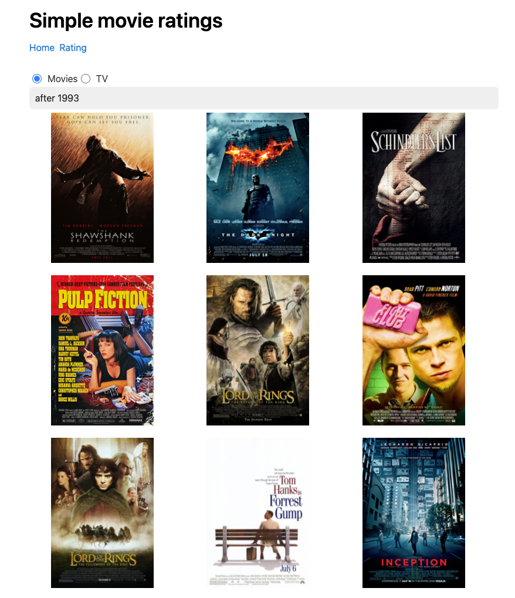

# Spring, React, Elasticsearch IMDB clone 

Movie and TV rating web application made with Spring, React and Elasticsearch. 



## Live Demo

Checkout the live demo at:   
[https://movie-engine-demo.vukotic.io/][demo]

## Repositories
Frontend: [https://github.com/nkzd/movie-rater-frontend][frontend-repo]   
Backend: [https://github.com/nkzd/movie-rater-backend][backend-repo]

## Development setup

##### Backend:  
  
Clone the repo:
``` git clone https://github.com/nkzd/movie-rater-backend.git```

Run elasticsearch: e.g.  
``` docker network create elastic ```   
``` docker pull docker.elastic.co/elasticsearch/elasticsearch:7.15.2 ```   
``` docker run --name es01-test --net elastic -p 127.0.0.1:9200:9200 -p 127.0.0.1:9300:9300 -e "discovery.type=single-node" docker.elastic.co/elasticsearch/elasticsearch:7.15.2 ```   

Run the backend app (default port is 8080) via docker or:  
```mvn clean package```  
```java -jar target/imdb-rater-0.0.1-SNAPSHOT.jar```

##### Frontend:

Clone the repo:
``` git clone https://github.com/nkzd/movie-rater-frontend.git```

Install the dependencies: 
```yarn install ```

Create a .env file with REACT_APP_BACKEND_URL enviroment variable that points to backend. Example can be found in .env.example file. Default is http://localhost:8080/.
``` REACT_APP_BACKEND_URL="http://localhost:8080/"```

Run the frontend app (default port is 3000): 
```yarn start```

## License

Distributed under the MIT license. See ``LICENSE`` for more information.

[https://github.com/nkzd][github]

<!-- Markdown link & img dfn's -->

[demo]: https://movie-engine-demo.vukotic.io/
[backend-repo]: https://github.com/nkzd/movie-rater-backend
[frontend-repo]: https://github.com/nkzd/movie-rater-frontend
[linkedin]: https://www.linkedin.com/in/aljosa-vukotic/
[github]: https://github.com/nkzd